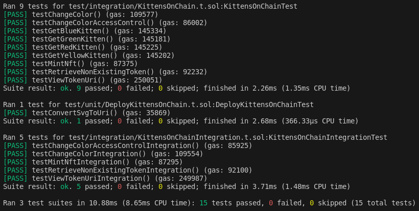

# KittensOnChain

KittensOnChain is a NFT project aim to fix the problem that there are not enough cats on the blockchain. This project was created while following the course "[Cifryn Updraft: Advanced Foundry](https://updraft.cyfrin.io/courses/advanced-foundry)" [[Reference](https://github.com/Cyfrin/foundry-nft-f23/)]. The contracts were built using [Foundry](https://book.getfoundry.sh/). The images were created using the AI [ChatGPT](https://openai.com/chatgpt) by [OpenAI](https://openai.com/).


| Index |
| ---   |
| [Project Layout](#project-layout) |
| [Deploy and interact](#deploy-and-interact) |
| [Tests](#tests) |

## Project Layout

There are three main folders:

1. `src/` - contains the solidity smart contracts
2. `test/` - contains test for the solidity smart contract of the ERC721 tokens
3. `script/` - contains the script to deploy the smart contract for the ERC721 token

## Deploy and interact

### Steps to deploy the contract and mint your first NFT

**Note:** You must import the account used to mint NFTs to your Metamask and set up Anvil before proceeding. Check and modify [Makefile](Makefile) accordingly.

**To deploy the contract**
1. In your web browser, open Metamask and ensure you are not on Anvil chain
2. Download this repository, you can use the command `git clone https://github.com/seeu-inspace/KittensOnChain.git`
3. Open a terminal from the directory `KittensOnChain`
4. Run the command `make all`
5. Run the command `make anvil`
6. In another terminal in the same directory, run the command `make deploy`

**To see your NFT**
1. Mint your NFT with the command `make mint`
2. Go to Metamask and import the Anvil private key used to mint the token
3. Import your NFT using the contract address and the tokenId

**To change the color of your NFT**
1. After you have imported the token, run the command `make changeColor`
2. Remove the token
3. Refresh Metamask
4. Import the token again


## Tests

In `/test` there are present
- [KittensOnChain.t.sol](test/integration/KittensOnChain.t.sol) and [KittensOnChainIntegration.t.sol](test/integration/KittensOnChainIntegration.t.sol), integration tests: These tests focus on verifying interactions between different modules or components of the KittensOnChain contract to ensure they work together correctly as a whole.
- [DeployKittensOnChain.t.sol](test/unit/DeployKittensOnChain.t.sol) unit test: This test concentrates on testing specific functionalities within the DeployKittensOnChain contract, such as the `svgToImageURI` function, to ensure individual units of code behave correctly.

To run the tests, use the command
```shell
make test
```


